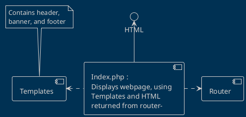

```plantuml
@startuml
!theme blueprint

[Templates] as T
() HTML as H

note top of T
  Contains header, 
  banner, and footer
endnote

component index.php [
Index.php : 
Displays webpage, using
Templates and HTML
returned from router-
]

T <. index.php
H <-- index.php

[Router] as R
index.php .> R

  

```

